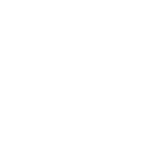

# MAST Branding

## Fonts
The font to be used on all headings/titles is [Mate](./fonts/Mate).

The font to be used on all regular text is [Play](./fonts/Play).

The font to be used in relation to Let's Code branding is [Kode Mono](./fonts/Kode_Mono).

The font to be used in relation to STEMventure branding is [Architect's Daughter](./fonts/Architects_Daughter).

## Coporate Logos
### Seal
| SVG | PNG |
| --- | --- |
|  |  |

### Logo
| SVG | PNG |
| --- | --- |
|  |  |
